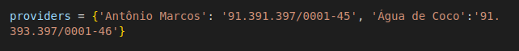
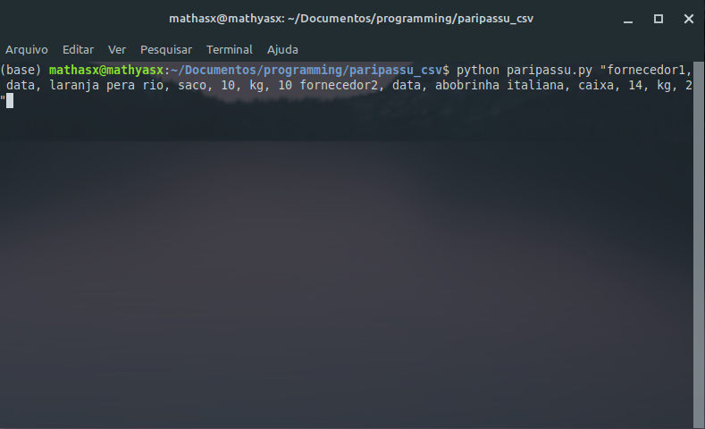

# Paripassu

## Sobre
Programa para a facilitação do modo 'compra por arquivo' do programa rastreador da empresa Paripassu
## Configurando
Para a utlização da forma correta do programa é necessário preencher o seguinte dicionario

o dicionario acima e preenchido da seguinte forma {'nome do fonecedor': 'cnpj do fornecedor'}.

Adicione todos fornecedores que irão ser usados nas impressões.

## Uso
O programa funciona da seguinte forma:

quem está utilizando irá copiar um texto que podera ser copiado de qualquer lugar(whatsapp, telegram, etc) desde que esteja de acordo com as seguintes obrigações:

"Nome do fornecedor, data, Nome do Produto, Embalagem, Capacidade embalagem, Unidade embalagem, Quantidade"

>* **Nome do Produto**: Nome do item que será imprimido;
>* **Embalagem**:caixa, bandeja, ou saco;
>* **Capacidade embalagem**:volume que a embalagem é capaz de acomodar;
>* **Unidade embalagem**:kg, UN ou L;
>* **Quantidade**: quantidade adquirida do produto.
    
Ex:
1. fornecedor1, data, laranja pera rio, saco, 10, kg, 10
2. fornecedor2, data, abobrinha italiana, caixa, 14, kg, 2
3. fornecedor3, data, coco verde, saco, 10, un, 4
Ex:

